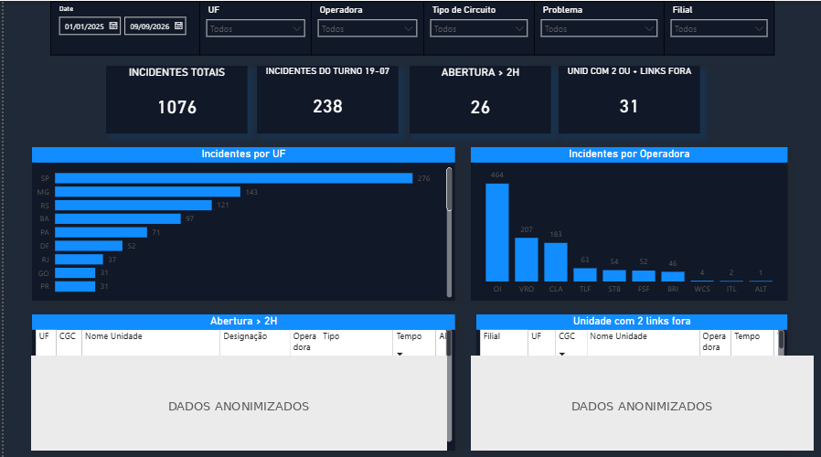
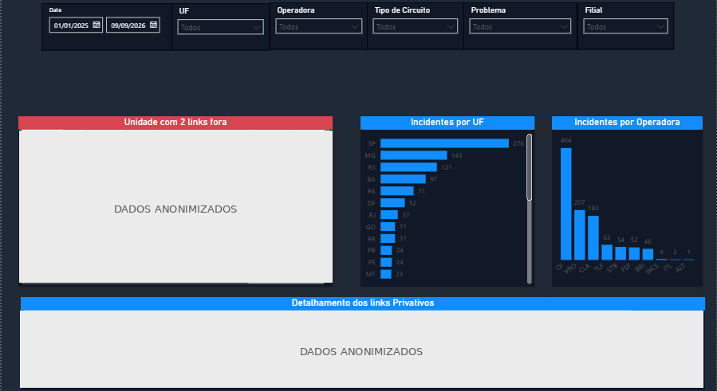
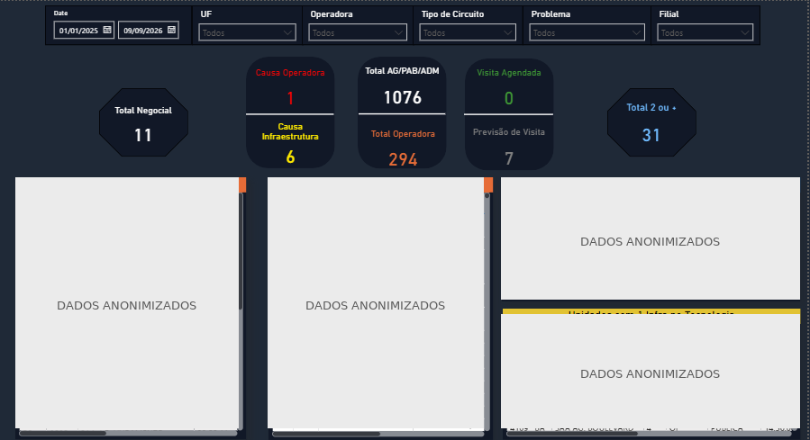

# Dashboard de Gestão de Incidentes de TI

Solução de Business Intelligence desenvolvida para análise, monitoramento e apoio à gestão de incidentes de infraestrutura de TI.

---

## 📌 Sobre o projeto

Este projeto consiste no desenvolvimento de um dashboard utilizando **Microsoft Power BI** para transformar dados operacionais provenientes de painéis de monitoramento de um sistema ITSM em informações visuais e analíticas.

A solução surgiu de uma necessidade operacional: facilitar a interpretação de uma grande quantidade de registros de incidentes e permitir a identificação de situações que podem demandar maior atenção da equipe.

O dashboard permite analisar os incidentes sob diferentes perspectivas, incluindo localização, operadora, tipo de circuito, problema, tempo de indisponibilidade e período de ocorrência.

---

## 🎯 Objetivo

Desenvolver uma solução de Business Intelligence capaz de organizar e visualizar dados de incidentes de infraestrutura de TI, facilitando a identificação de situações relevantes para o acompanhamento operacional e apoiando o planejamento das atividades da equipe.

---

## 🔎 Problema

Os dados disponibilizados pelos painéis de monitoramento são apresentados principalmente em formato tabular, o que pode dificultar a identificação rápida de padrões, concentrações de incidentes e ocorrências que necessitam de acompanhamento.

Entre as situações analisadas estão:

- unidades com múltiplos circuitos afetados;
- incidentes com elevado tempo de indisponibilidade;
- ocorrências de abertura superiores a duas horas;
- incidentes relacionados a operadoras;
- circuitos classificados como infraestrutura que permanecem como ocorrências isoladas;
- ocorrências em diferentes estágios de atendimento pelo provedor.

O dashboard organiza essas informações por meio de indicadores, gráficos, filtros e tabelas de detalhamento.

---

## 🏗️ Arquitetura da solução

O fluxo geral da solução é:

```text
Sistema ITSM
     │
     │ Exportação
     ▼
Arquivo Excel
     │
     ▼
Power Query
     │
     │ Tratamento e transformação
     ▼
Modelo de dados Power BI
     │
     │ Medidas e regras DAX
     ▼
Dashboard
```

A solução utiliza informações provenientes de dois painéis operacionais:

### Painel Negocial

Apresenta a perspectiva das **unidades indisponíveis** e suas respectivas causas.

### Painel Tecnologia

Apresenta o **detalhamento dos circuitos** associados às ocorrências das unidades.

A combinação das duas perspectivas permite realizar análises mais detalhadas do cenário operacional.

---

## 📊 Estrutura do dashboard

O relatório é organizado em três páginas principais:

### Visão Geral

Apresenta uma visão consolidada do cenário de incidentes, incluindo:

- incidentes totais;
- incidentes do turno 19–07;
- aberturas superiores a duas horas;
- unidades com dois ou mais circuitos afetados;
- incidentes por UF;
- incidentes por operadora;
- detalhamento das ocorrências de abertura superiores a duas horas.

### Detalhes

Permite aprofundar a análise dos registros, incluindo:

- unidades com múltiplos circuitos afetados;
- incidentes por UF;
- incidentes por operadora;
- detalhamento dos links privativos.

### Leituras Operacionais

Reúne análises específicas para identificação de situações que podem demandar atenção, incluindo:

- unidades indisponíveis;
- causas Operadora e Infraestrutura;
- circuitos alarmados;
- ocorrências com previsão de visita;
- ocorrências com visita agendada;
- unidades com dois ou mais links afetados;
- circuitos com mais de 100 horas de indisponibilidade;
- aberturas superiores a duas horas;
- unidades com um único circuito classificado como infraestrutura.

---

## 🧠 Regras de análise

O dashboard utiliza regras implementadas em **DAX** para transformar os dados operacionais em indicadores.

Entre os principais critérios estão:

| Indicador | Critério |
|---|---|
| Abertura > 2h | `Operadora - Abertura` + tempo superior a 2 horas |
| 2+ circuitos | Duas ou mais designações distintas associadas a ocorrências de operadora |
| Circuitos >100h | Tempo de indisponibilidade superior a 100 horas |
| Previsão de visita | `Operadora - Previsão de Visita` |
| Visita agendada | `Operadora - Visita Agendada` |
| 1 circuito de Infraestrutura | Exatamente um circuito classificado como infraestrutura |

As regras são utilizadas como mecanismos de **sinalização e apoio à análise**, não como substituição da avaliação da equipe responsável.

---

## 🎛️ Filtros

As páginas do dashboard possuem seis segmentadores:

- Data;
- UF;
- Operadora;
- Tipo de circuito;
- Problema;
- Filial.

Os filtros permitem alterar dinamicamente o contexto das análises.

---

## 🧩 Modelo de dados

O modelo utiliza como principais estruturas de dados:

- `F_Incidentes` — dados do painel Tecnologia;
- `Negocial` — dados do painel Negocial;
- `D_Calendario` — dimensão temporal;
- `Dim_UF` — dimensão de UF;
- `Dim_Operadora` — dimensão de operadora;
- `Dim_Unidade` — dimensão de unidades;
- estruturas auxiliares relacionadas a circuitos privativos.

As tabelas `F_Incidentes` e `Negocial` utilizam `Data_Plantao` para relacionamento com a dimensão `D_Calendario`.

---

## 🛠️ Tecnologias utilizadas

- **Microsoft Power BI**
- **Power Query**
- **DAX**
- **Microsoft Excel**
- **GitHub**

---

## 📚 Documentação

Documentação complementar do projeto:

- [Modelo de Dados](documentacao/modelo-dados.md)
- [Regras de Negócio](documentacao/regras-negocio.md)
- [Indicadores](documentacao/indicadores.md)

---

## 📊 Demonstração do dashboard

### Visão Geral



### Detalhes



### Leituras Operacionais



---

## 🔐 Dados e segurança

O projeto foi documentado de forma a preservar a confidencialidade das informações do ambiente de origem.

As imagens disponibilizadas neste repositório foram anonimizadas.

Não são disponibilizados dados corporativos originais, credenciais, endereços internos, identificadores de equipamentos ou outras informações que possam comprometer a segurança ou a confidencialidade do ambiente de origem.

---

## ⚠️ Limitações

A solução atualmente depende da exportação dos dados do sistema ITSM para arquivos Excel.

Dessa forma, a atualização do dashboard depende da obtenção e preparação dos dados da fonte.

Os arquivos de origem utilizados no ambiente operacional não fazem parte deste repositório.

---

## 🚀 Possíveis evoluções

Entre as possibilidades de evolução da solução estão:

- integração direta com a fonte de dados do ITSM;
- redução da dependência da exportação manual;
- automatização do processo de atualização;
- criação de novos indicadores;
- evolução das regras de priorização;
- utilização de dados históricos para identificação de padrões;
- ampliação dos recursos de apoio à tomada de decisão.

---

## 👤 Autoria

**Fábio William**

Projeto desenvolvido para estudo, desenvolvimento profissional e documentação de uma solução de Business Intelligence aplicada à gestão de incidentes de infraestrutura de TI.
